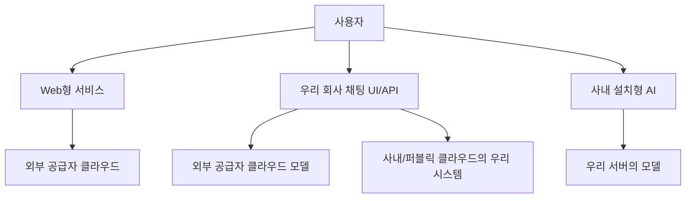
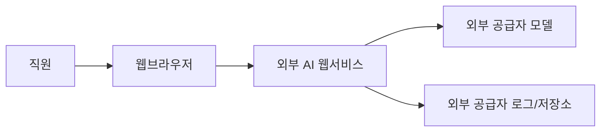
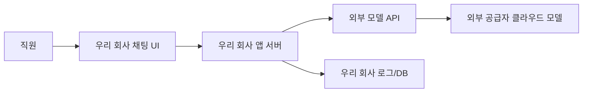
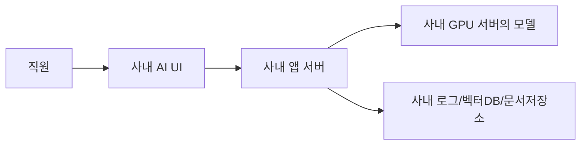
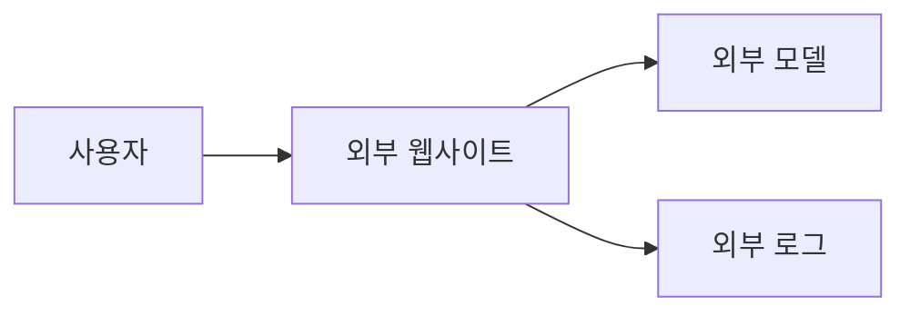
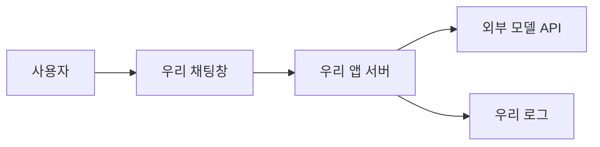
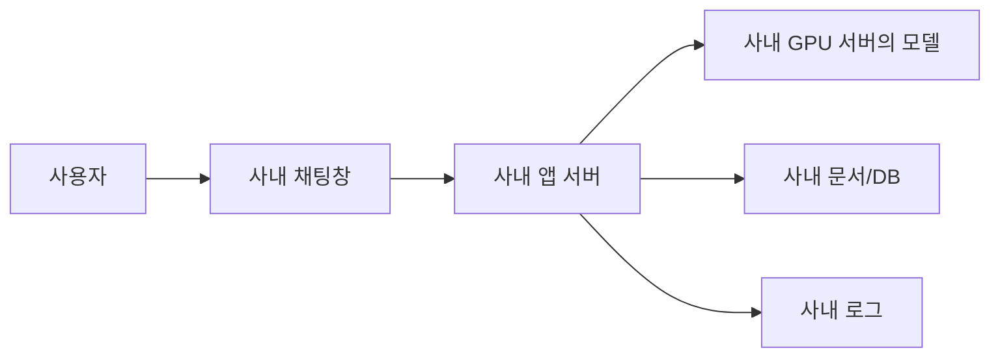

# 생성형 AI 보안, 비전문가를 위한 쉬운 설명

부제: **Web형 / 기업형(API) / 설치형(온프레미스)** 을 어떻게 이해하고, 무엇을 조심해야 하나?

---

## 0. 이 문서의 목적

이 문서는 기술 비전문가도 아래를 이해할 수 있게 설명합니다.

- LLM이 무엇인지
- 생성형 AI는 어떤 방식으로 제공되는지
- 어디에 설치하거나 연동하는지
- 각 방식에서 **우리 정보가 밖으로 나갈 수 있는지**
- **학습에 쓰일 수 있는지**
- **외부 공급자가 우리 데이터를 볼 수 있는지**
- 어떤 방식이 가장 안전한지

---

# 1. 먼저: LLM이 뭐냐?

## 아주 쉽게
**LLM(대규모 언어모델)** 은
엄청나게 많은 글, 문서, 코드, 질문-답변을 학습해서
사람처럼 문장을 만들고, 요약하고, 설명하고, 코드를 쓰는 AI입니다.

예:
- ChatGPT
- Claude
- Gemini
- EXAONE
- HyperCLOVA X
- Qwen
- DeepSeek

## 비유
LLM은 **엄청 똑똑한 문서 비서**처럼 생각하면 됩니다.

할 수 있는 것:
- 질문 답변
- 문서 요약
- 보고서 초안 작성
- 코드 작성
- 회의록 정리
- 검색 결과 정리

하지만 중요한 점:
> 이 AI가 **어디에서 실행되느냐**에 따라 보안이 완전히 달라집니다.

---

# 2. 공급자는 누구냐?

생성형 AI 공급자는 크게 3종류로 볼 수 있습니다.

## 2-1. 글로벌 상용 공급자
- OpenAI
- Anthropic
- Google
- Microsoft (Azure OpenAI 등)
- Amazon Bedrock(플랫폼)

## 2-2. 국내 공급자
- NAVER HyperCLOVA X
- LG EXAONE / ChatEXAONE
- Samsung Gauss / 삼성SDS AI 플랫폼

## 2-3. 오픈모델/오픈웨이트 진영
- Qwen
- DeepSeek
- GLM
- Llama
- Mistral
- 기타 Hugging Face 공개 모델

### 차이
- **상용 공급자**: 보통 웹 또는 API로 사용
- **국내 공급자**: 기업형/프라이빗형 옵션이 많음
- **오픈모델**: 내려받아 직접 설치 가능

---

# 3. 제공 방식은 크게 3개

생성형 AI는 보통 아래 3가지 방식으로 씁니다.

## A. Web형
예:
- ChatGPT 웹사이트 접속
- Claude 웹사이트 접속
- Gemini 웹 접속

## B. 기업형(API)
예:
- 우리 회사 채팅창을 만들고
- 뒤에서는 OpenAI/Claude API 호출
- 채팅 UI는 우리 회사 것이지만, 모델은 외부 클라우드에서 돌음

## C. 설치형(온프레미스 / 셀프호스팅)
예:
- 모델을 우리 서버에 설치
- 사내망에서만 사용
- 외부 API를 안 부름

---

# 4. 가장 쉬운 전체 그림

핵심은 이거입니다.

- **Web형**: 거의 다 밖으로 나감
- **기업형(API)**: 우리 UI는 내부여도, 모델 호출은 밖으로 나갈 수 있음
- **설치형**: 모델까지 우리 안에 있으면 가장 안전

---

# 5. Web형이란?

## 예시
- chat.openai.com
- claude.ai
- gemini.google.com

## 사용 방식
직원이 브라우저로 직접 들어가서 질문합니다.

## 어디에서 실행되나?
- 웹사이트: 외부 공급자
- 모델: 외부 공급자 클라우드
- 채팅 로그: 외부 공급자 쪽에 저장될 수 있음

## 구조

## 보안 관점
### 장점
- 가장 쉽다
- 구축이 필요 없다
- 빨리 써볼 수 있다

### 단점
- 우리 질문/문서 내용이 외부로 전송됨
- 채팅 내용이 외부 서비스에 저장될 수 있음
- 학습/모델 개선에 쓰이는지 정책을 반드시 확인해야 함
- 누가 뭘 넣는지 회사가 통제하기 어려움

## 쉬운 한 줄
> **편하지만, 가장 조심해야 하는 방식**

---

# 6. 기업형(API)이란?

## 예시
- 우리 회사 포털 안에 “AI 채팅창”을 만듦
- 사용자는 사내 시스템이라고 느끼지만
- 실제 답변 생성은 OpenAI/Claude/Gemini/NAVER 같은 외부 모델 API가 처리

## 사용 방식
1. 직원이 우리 회사 채팅창에 질문
2. 우리 서버가 그 질문을 받아서
3. 외부 공급자 API로 전송
4. 외부 모델이 답변
5. 우리 UI에 다시 표시

## 구조

## 핵심 포인트
이 경우는 **채팅창은 내부**지만
**모델은 외부**입니다.

즉:
- 채팅 UI를 우리가 직접 만들어도
- 질문/파일/프롬프트는 외부로 갈 수 있습니다.

## 보안 관점
### 장점
- 회사가 UI, 인증, 권한, 로그를 통제 가능
- SSO, 접근권한, 부서별 정책 반영 가능
- 업무 시스템과 쉽게 연결 가능

### 단점
- 모델 호출 데이터는 여전히 외부 공급자에 갈 수 있음
- 공급자 정책에 따라 저장/보존 가능성 있음
- 민감정보가 포함되면 위험

## 쉬운 한 줄
> **겉은 내부 시스템이지만, 두뇌는 외부에 있을 수 있다**

---

# 7. 설치형(온프레미스)이란?

## 예시
- Qwen, DeepSeek, EXAONE 등을 우리 GPU 서버에 설치
- 회사 내부망에서만 실행
- 외부 API 호출 없이 운영

## 구조

## 보안 관점
### 장점
- 데이터가 외부 공급자로 안 나갈 수 있음
- 폐쇄망 운영 가능
- 학습/저장/접근 권한을 회사가 직접 통제 가능
- 가장 높은 보안 수준 가능

### 단점
- 서버/GPU 비용이 큼
- 운영이 어렵다
- 모델 업데이트와 성능 관리도 직접 해야 함
- 보안이 자동으로 생기는 건 아님 (잘못 구성하면 내부 유출 가능)

## 쉬운 한 줄
> **가장 안전하게 만들 수 있지만, 가장 직접 운영해야 한다**

---

# 8. 그런데 “온프레미스”와 “퍼블릭 클라우드”는 또 뭐가 다르냐?

이건 **인프라 위치** 이야기입니다.

## 8-1. 온프레미스 인프라
- 우리 회사 건물/데이터센터 안 서버
- 우리가 직접 관리

## 8-2. 퍼블릭 클라우드 인프라
- AWS, Azure, GCP, Naver Cloud 같은 외부 클라우드 위에
- 우리 전용 시스템을 올림
- 하드웨어는 남의 것이지만, 논리적으로는 우리 환경

즉 질문은 2개를 따로 봐야 합니다.

### 질문 1: **인프라가 어디 있나?**
- 우리 데이터센터?
- 퍼블릭 클라우드?

### 질문 2: **모델이 누구 것이고 어디서 돌고 있나?**
- 외부 공급자 모델?
- 우리 설치 모델?

이 둘은 완전히 다른 축입니다.

---

# 9. 케이스를 표로 정리하면

## Case 1. Web형 SaaS
- 예: ChatGPT 웹 접속
- 인프라: 외부 공급자
- 모델: 외부 공급자
- 데이터 전송: 외부로 감
- 회사 통제: 낮음

## Case 2. 기업형 UI + 외부 모델 API
- 인프라: 우리 서버 또는 퍼블릭 클라우드
- 모델: 외부 공급자
- 데이터 전송: 모델 호출 시 외부로 감
- 회사 통제: 중간

## Case 3. 기업형 UI + 우리 퍼블릭 클라우드 + 자체 설치 모델
- 인프라: AWS/Azure/GCP/Naver Cloud의 우리 계정
- 모델: 우리가 직접 배포한 모델
- 데이터 전송: 원칙적으로 외부 모델 공급자에 안 감
- 회사 통제: 높음

## Case 4. 기업형 UI + 우리 온프레미스 + 자체 설치 모델
- 인프라: 회사 내부
- 모델: 회사 내부 GPU 서버
- 데이터 전송: 외부 안 나가게 구성 가능
- 회사 통제: 매우 높음

## Case 5. 기업형 UI + 전용 프라이빗 클라우드형 공급자 서비스
- 예: NeuroCloud, 전용기업형 ChatExaone
- 인프라: 고객 전용 또는 폐쇄형
- 모델: 공급자 모델이지만 전용환경에 탑재
- 데이터 전송: 일반 SaaS보다 통제 가능
- 회사 통제: 높음~매우 높음

---

# 10. 가장 중요한 표: 보안성 비교

| 케이스 | 데이터 외부 유출 가능성 | 학습에 쓰일 가능성 | 외부에서 우리 데이터 볼 가능성 | 회사 통제 수준 | 쉬운 설명 |
|---|---|---|---|---|---|
| Web형 SaaS | 높음 | 정책에 따라 가능 | 상대적으로 높음 | 낮음 | 편하지만 가장 조심 |
| 기업형 UI + 외부 API | 중간~높음 | 정책/계약에 따라 다름 | 공급자/운영자 접근 가능성 존재 | 중간 | 겉은 내부, 두뇌는 외부 |
| 우리 퍼블릭 클라우드 + 자체 모델 | 낮음~중간 | 우리가 따로 학습 안 하면 낮음 | 우리 운영자/클라우드 관리자 | 높음 | 외부 클라우드에 있지만 우리 환경 |
| 우리 온프레미스 + 자체 모델 | 가장 낮음 | 우리가 하지 않으면 없음 | 우리 내부 관리자만 가능 | 매우 높음 | 가장 강한 통제 |
| 전용 프라이빗/폐쇄형 공급자 | 낮음 | 계약에 따라 제한 가능 | 제한적, 통제 조건 협의 가능 | 높음 | 안전성과 편의성의 절충형 |

---

# 11. “학습에 쓰이나요?”를 쉽게 설명하면

이 질문은 사람들이 가장 헷갈려합니다.

## 경우 1. 일반 웹형 서비스
- 서비스 정책에 따라
- 입력한 내용이 **서비스 개선이나 학습 검토**에 쓰일 가능성이 있을 수 있음
- 반드시 상품 약관/개인정보/데이터 사용 정책 확인 필요

## 경우 2. 기업형 API / Enterprise 상품
- 보통은 **고객 데이터로 기본 모델 학습을 하지 않는다**는 정책이 많음
- 하지만 **로그 보존, 악용 탐지, 운영 검토**는 남을 수 있음
- 계약서와 서비스 문서를 봐야 함

## 경우 3. 자체 설치형
- 외부 공급자 학습에는 안 쓰임
- 다만 **우리 회사가 로그/대화 저장을 하면 내부적으로는 남음**
- 즉 “외부 학습 없음”과 “아무도 못 봄”은 다름

### 한 줄 정리
> **학습 안 한다**와 **아무도 데이터 못 본다**는 같은 말이 아닙니다.

---

# 12. “외부에서 우리 데이터를 볼 수 있나요?”

이것도 나눠서 봐야 합니다.

## Web형 / 외부 API형
가능성 있습니다.
- 공급자 운영상 접근권한
- 장애 대응/보안 분석
- 법적 요청 대응
- 저장 정책

## 자체 설치형
외부 공급자는 못 보게 설계 가능하지만,
- 우리 내부 관리자
- 운영팀
- 로그 시스템 관리자
는 볼 수 있을 수 있습니다.

즉 보안은 항상
- 외부 공급자 리스크
- 내부자 리스크
둘 다 봐야 합니다.

---

# 13. 가장 쉬운 도식: 무엇이 어디에 있나?

## 13-1. Web형

## 13-2. 기업형 API

## 13-3. 자체 설치형

---

# 14. 인프라 위치와 모델 위치를 2축으로 보면

## 축 1. 인프라 위치
- 온프레미스(우리 서버실)
- 퍼블릭 클라우드(AWS/Azure/GCP/Naver Cloud)

## 축 2. 모델 위치
- 외부 공급자 모델
- 우리가 설치한 모델

이걸 조합하면 4가지가 나옵니다.

| 인프라 | 모델 | 의미 |
|---|---|---|
| 외부 SaaS | 외부 공급자 | 일반 Web형 |
| 우리 앱(온프렘/클라우드) | 외부 공급자 | 기업형 API |
| 우리 퍼블릭 클라우드 | 우리 설치 모델 | 클라우드 self-host |
| 우리 온프레미스 | 우리 설치 모델 | 완전 자체형 |

---

# 15. 각 방식의 쉬운 비유

## Web형
**외부 로펌 사무실에 직접 가서 상담 받는 것**
- 편함
- 빠름
- 하지만 우리 문서를 외부 사무실에 들고 가는 셈

## 기업형 API
**우리 회사 상담창구가 있지만 실제 전문가는 외부에 있는 것**
- 겉은 내부
- 실제 답변은 외부 전문가가 생성

## 자체 설치형
**우리 회사 안에 전담 변호사실을 직접 만든 것**
- 가장 통제 가능
- 대신 채용/운영/관리 비용이 듦

---

# 16. 비전문가용 추천 원칙

## 가장 안전하게 가려면
1. **민감정보는 가능하면 자체 설치형**
2. 외부 API를 써야 하면 **Enterprise 계약/정책 확인**
3. Web형은 파일 업로드/민감문서 입력 최소화
4. 로그 저장 범위와 권한을 명확히
5. RAG/문서검색도 권한 통제 필요

---

# 17. 실무에서 자주 하는 오해

## 오해 1
“우리 회사 채팅창이면 내부 AI다”  
→ **아님**. 뒤에서 외부 API를 부를 수 있음

## 오해 2
“학습에 안 쓰면 안전하다”  
→ **아님**. 저장/조회/운영자 접근 리스크는 남음

## 오해 3
“온프레미스면 무조건 안전하다”  
→ **아님**. 내부 관리자/로그/권한 설계가 중요

## 오해 4
“퍼블릭 클라우드면 다 외부 유출이다”  
→ **아님**. 우리 계정의 폐쇄형 private deployment는 상당히 통제 가능

---

# 18. 아주 쉬운 최종 요약

## 가장 덜 안전한 순서
1. **일반 Web형 SaaS**
2. **기업형 UI + 외부 모델 API**
3. **우리 퍼블릭 클라우드 + 자체 모델**
4. **우리 온프레미스 + 자체 모델**

## 가장 쉬운 순서
1. **Web형**
2. **기업형 API**
3. **퍼블릭 클라우드 self-host**
4. **온프레미스 self-host**

## 가장 중요한 질문 3개
도입 전에 이것만 꼭 물으면 됩니다.

1. **내 질문/파일이 외부 모델 공급자에게 가나요?**
2. **그 데이터가 저장되거나 학습에 쓰이나요?**
3. **우리 회사 외부에서 그 데이터를 볼 수 있는 사람/조직이 있나요?**

---

# 19. 의사결정용 한 장 요약

## 업무 성격별 추천
- **일반 생산성 / 아이디어 / 비민감 문서** → 기업형 API도 가능
- **사내 문서 검색 / 부서업무 보조** → 기업형 API 또는 private deployment
- **금융/법무/인사/연구기밀** → 전용 프라이빗 또는 자체 설치형 우선
- **최고 보안 요구** → 온프레미스 self-host

---

# 20. 발표용 마지막 한 문장

> 생성형 AI 보안은 “AI가 똑똑하냐”의 문제가 아니라, **우리 데이터가 어디로 가고, 누가 볼 수 있고, 누가 통제하느냐의 문제**입니다.

---

## 부록: 장표 제목 예시
- 생성형 AI란 무엇인가?
- Web형 / 기업형 / 설치형의 차이
- 인프라 위치 vs 모델 위치
- 데이터가 어디로 가는가?
- 어떤 경우에 외부 유출 가능성이 생기는가?
- 우리 회사는 어떤 방식을 선택해야 하는가?
