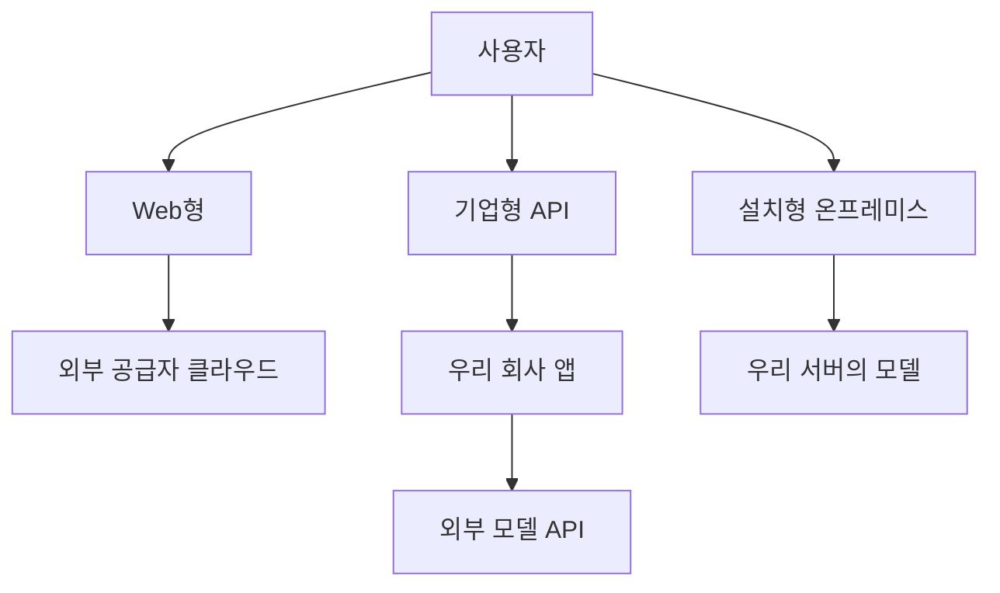

# 생성형 AI 보안 장표형 요약 (10장 내)

---

## 1. 제목
**생성형 AI 보안, 비전문가를 위한 핵심 이해**

부제: Web형 / 기업형(API) / 설치형(온프레미스)은 무엇이 다르고, 보안은 어떻게 달라지는가?

---

## 2. 생성형 AI와 LLM이란?
- LLM은 대규모 언어모델
- 질문 답변, 요약, 보고서 작성, 코드 생성 가능
- ChatGPT, Claude, Gemini, EXAONE, HyperCLOVA X 등이 대표적

**핵심 포인트**
- AI가 얼마나 똑똑한지보다
- **어디서 실행되는지**가 보안에 더 중요함

---

## 3. 공급자 유형
### 글로벌 상용
- OpenAI
- Anthropic
- Google

### 국내
- NAVER HyperCLOVA X
- LG EXAONE / ChatExaone
- Samsung Gauss

### 오픈모델
- Qwen
- DeepSeek
- GLM
- Llama
- Mistral

---

## 4. 제공 방식 3가지
### 1) Web형
- 웹사이트에 직접 접속
- 예: ChatGPT 웹, Claude 웹

### 2) 기업형(API)
- 우리 회사 채팅창은 내부
- 하지만 실제 모델은 외부 API일 수 있음

### 3) 설치형(온프레미스)
- 모델을 우리 서버/GPU에 설치
- 외부 API 없이 내부에서만 동작 가능

---

## 5. 가장 쉬운 구조 이해

---

## 6. Web형의 보안 특성
### 장점
- 가장 쉽고 빠름
- 구축 필요 없음

### 단점
- 데이터가 외부로 직접 전송될 수 있음
- 채팅 로그가 외부 서비스에 남을 수 있음
- 학습/저장 정책 확인 필요

**한 줄 요약**
> 편하지만 가장 조심해야 하는 방식

---

## 7. 기업형(API)의 보안 특성
### 장점
- 우리 UI, 인증, 로그, 접근권한 통제 가능
- 사내 시스템과 연결 쉬움

### 단점
- 실제 모델 호출은 외부 공급자일 수 있음
- 즉, 데이터가 외부 API로 갈 수 있음

**핵심 문장**
> 겉은 내부 시스템이어도, 두뇌는 외부에 있을 수 있음

---

## 8. 설치형(온프레미스)의 보안 특성
### 장점
- 외부 공급자로 데이터가 안 나가게 설계 가능
- 폐쇄망 운영 가능
- 가장 강한 통제 가능

### 단점
- 구축/운영 비용 큼
- GPU, MLOps, 보안 운영 필요
- 잘못 구성하면 내부 유출은 여전히 가능

**한 줄 요약**
> 가장 안전하게 만들 수 있지만, 가장 직접 운영해야 함

---

## 9. 케이스별 보안 비교
| 케이스 | 외부 유출 가능성 | 학습 가능성 | 외부에서 우리 데이터 볼 가능성 | 통제 수준 |
|---|---|---|---|---|
| Web형 SaaS | 높음 | 정책에 따라 있음 | 상대적으로 높음 | 낮음 |
| 기업형 UI + 외부 API | 중간~높음 | 정책/계약 따라 다름 | 공급자 접근 가능성 존재 | 중간 |
| 우리 퍼블릭 클라우드 + 자체 모델 | 낮음~중간 | 우리가 안 하면 없음 | 우리 운영자/클라우드 관리자 | 높음 |
| 우리 온프레미스 + 자체 모델 | 가장 낮음 | 우리가 안 하면 없음 | 우리 내부 관리자 | 매우 높음 |
| 전용 프라이빗/폐쇄형 공급자 | 낮음 | 계약으로 제한 가능 | 제한적 | 높음~매우 높음 |

---

## 10. 경영진용 핵심 메시지
### 가장 중요한 질문 3개
1. 우리 데이터가 외부 모델 공급자에게 가는가?
2. 저장되거나 학습에 쓰이는가?
3. 외부에서 그 데이터를 볼 수 있는가?

### 추천 원칙
- 비민감 업무: 기업형 API 가능
- 사내 문서/부서업무: 기업형 API 또는 private deployment
- 금융/법무/인사/연구기밀: 전용 프라이빗 또는 자체 설치형 우선
- 최고 보안 요구: 온프레미스 self-host

### 마지막 한 문장
> 생성형 AI 보안은 “AI가 얼마나 똑똑한가”보다, **우리 데이터가 어디로 가고 누가 통제하느냐**의 문제다.
